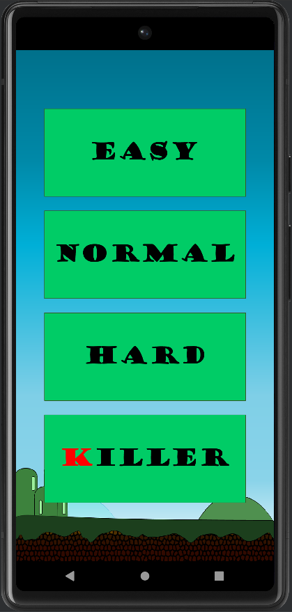

# Running-Dude 
First Android Game Development Practice Project

   

## Introduction
Simple and Easy! Play as running dude and collect as many diamonds as you can! Challenge yourself and break your personal best score each attempt! 

 
## Game Rules/Description

**Objective of the game:**  
Get as many points as you can by grabbing as many diamonds as you can. Try to avoid the toxins to prevent you from taking damage. If you are damaged, try to grab the health-kit to heal back your health. Additionally, if you are at full health, the health-kit will grant you 2 points instead!

**Start of the game**  
When the game starts, you will be prompted to choose your preferred difficulty mode. There is a total of 4 modes for you to choose from: Easy, Normal, Hard and Killer mode. For any mode, you get to start with 3 lives. Once you lose all 3 health, the game will end. When the game end, your score will be recorded and your best score will be updated accordingly. 

**End of the game**  
Tap the screen again if you want to re-challenge the same difficulty mode. Close and re-open the application if you wish to change the difficulty level.

** Items **  
There are 3 types of items in the game: Diamond, Toxin and Health-Kit.
1. Each diamond rewards you with 1 point.
2. Each toxic cost you 1 live.
3. Each Health-Kit rewards you with 1 live if you are damaged or 2 points if you are healthy.

**How to play**  
Tap the screen for the game character (running dude) to jump higher. Release and avoid touching the screen for the game character (running dude) to fall down.
Constantly move up and down to obtain the diamonds and health-kit and at the same time avoid the toxin.

**Legend**  

## Screenshot Demo
 

**Start-Up Screen (a.k.a Mode Selection)**  

     

**Gameplay**  

   

**Game Over**  

     

## Acknowledgement 
1. **Character by:** bevouliin.com
2. **Diamond:** <a href="https://www.flaticon.com/free-icons/diamond" title="diamond icons">Diamond icons created by Freepik - Flaticon</a>
3. **Toxin Icon:** <a href="https://www.flaticon.com/free-icons/skull" title="skull icons">Skull icons created by Freepik - Flaticon</a>
4. **Health-Kit:** <a href="https://www.flaticon.com/free-icons/first-aid-kit" title="first aid kit icons">First aid kit icons created by kosonicon - Flaticon</a>
5. **Heart Red:** <a href="https://www.flaticon.com/free-icons/item" title="item icons">Item icons created by Smashicons - Flaticon</a>
6. **Heart White:** <a href="https://www.flaticon.com/free-icons/love-and-romance" title="love and romance icons">Love and romance icons created by Smashicons - Flaticon</a>
7. **Background:** Image by <a href="https://pixabay.com/users/pixel_perfect-1411206/?utm_source=link-attribution&amp;utm_medium=referral&amp;utm_campaign=image&amp;utm_content=1405076">Pixel_perfect</a> from <a href="https://pixabay.com//?utm_source=link-attribution&amp;utm_medium=referral&amp;utm_campaign=image&amp;utm_content=1405076">Pixabay</a>

*Idea from Super Mario / Flappy Bird Clone*
